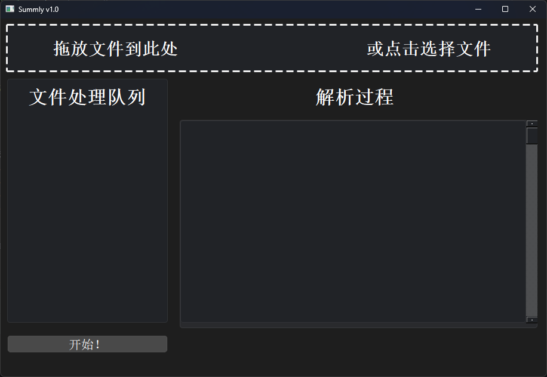
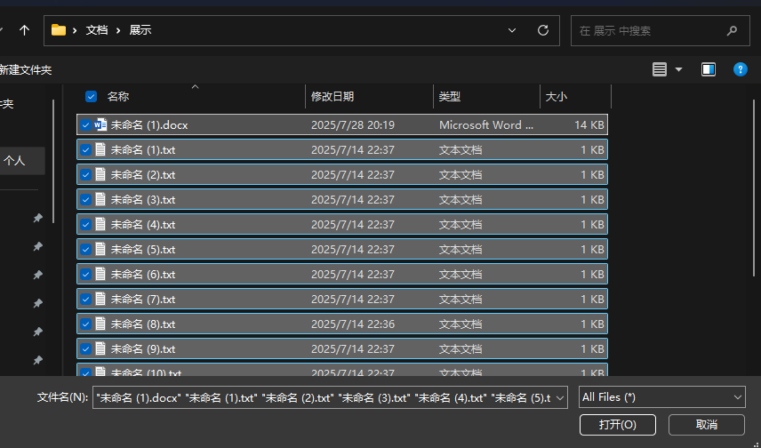

<h1>ABNamer</h1>

AI Batch, rename with a match

**English** | [Other language](https://github.com/Purrbyte-zdy/ABNamer/tree/main/docs/readme/)

## 📃 Introduction

ABNamer is an AI-powered tool that simplifies bulk file renaming by leveraging text analysis. Designed for efficiency, it automatically summarizes file content to generate meaningful, consistent names—eliminating tedious manual work.
Ideal for organizing documents, articles, or text-based files, its smart engine analyzes text content and metadata to create logical names aligned with your needs.
Replace chaotic filenames with context-driven labels. AI-enhanced, ABNamer streamlines digital organization by turning text content into clear, searchable file names.

***⚠️ Disclaimer: This AI hallucination is serious, please use it with caution and do not use it to process important documents.***

**The AI model runs locally, without the need for an internet connection, and does not upload files to the cloud without the user's consent.**

## 📷 Screenshots

## 🍕 Usage

You can install ABNamer via releases.

You can also build it by yourself.

## 😋 Contributors

## ⚖️ License
This project is licensed under the **Apache 2.0** License, you can learn more about it in the [license file](./LICENSE).

**Copyright © 2025 Purrbyte-zdy&Fishlinsihan**

This is an experimental project by [Dragon Studio](https://dragonstudio.top).  
Welcome to suggest and contribute to this project.

This readme is modified from the RinUI readme.